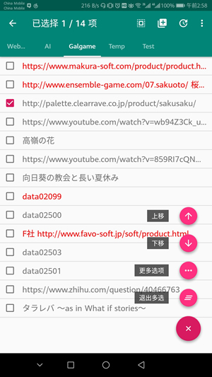
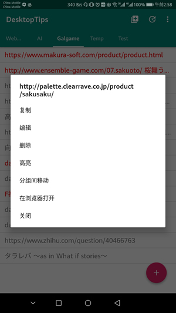
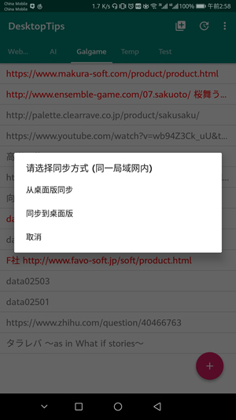
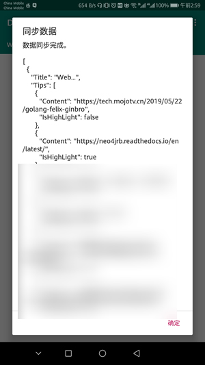

# DesktopTips_Android

+ Android version of windows [DesktopTips](https://github.com/Aoi-hosizora/DesktopTips) tool
+ Main for data transmission (use socket in LAN) between desktop version

### Environment

+ `Android Studio 3.4.1`
+ `JDK 1.8.0_131`
+ `kotlinc-jvm 1.3.31`

### Platform Setting

+ `minSdkVersion 23`
+ `targetSdkVersion 28`

### Dependencies

+ [jackson-module-kotlin](https://github.com/FasterXML/jackson-module-kotlin)
+ [FloatingActionsMenu](https://jcenter.bintray.com/com/getbase/floatingactionbutton/1.10.1/)
+ [LibZXing](https://github.com/jwkj/LibZXing)

### Screenshots

### References

+ [Kotlin Reference](https://kotlinlang.org/docs/reference/)